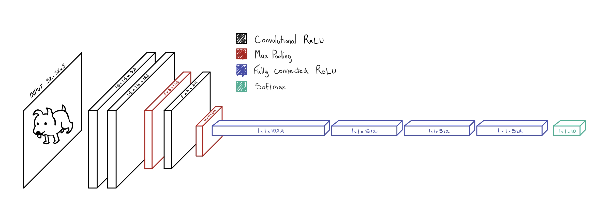
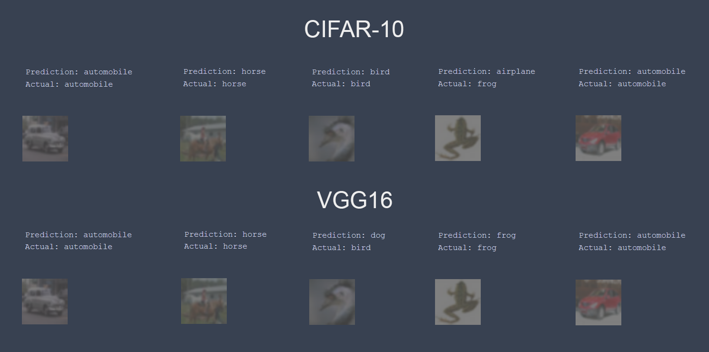
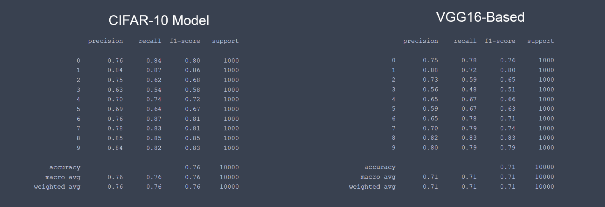

# CIFAR-10 Image Classifier
An image classification model trained using a transfer learning, computer vision model based on the CIFAR-10 dataset. In this notebook, we compare the performance of an image classifier trained directly with the CIFAR-10 dataset, and a transfer learning model based on (VGG16)[https://neurohive.io/en/popular-networks/vgg16/]. Below is the architecture of our model trained with CIFAR-10, a comparison of our two model's precision, recall, and F1-scores, and a sample of five random predicted images from each model. [See full project report.](https://saechaol.com/images/pdf/ml_cifar_report.pdf)

Contributors: Lucas Saechao. Ashley Thor. Noah Venethongkham.
